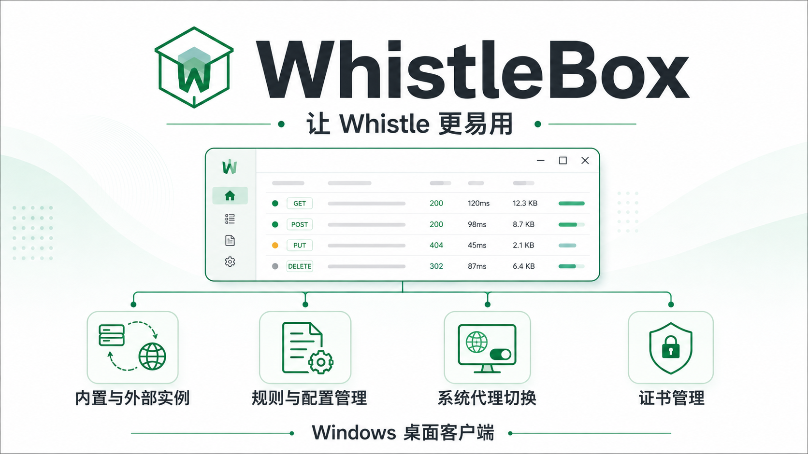

# WhistleBox

面向 Windows 的 Whistle 桌面客户端。内置 Node.js 与 Whistle，也可以连接已有实例，在一个窗口中管理网络调试、代理规则和证书。



[下载安装](https://github.com/fu9zhou/whistle-box/releases/latest) · [更新记录](CHANGELOG.md) · [问题反馈](https://github.com/fu9zhou/whistle-box/issues) · [构建状态](https://github.com/fu9zhou/whistle-box/actions/workflows/windows.yml)

> 上图为项目介绍示意图。目前发布 Windows x64 安装包；macOS、Linux 暂无经过验收的发行版。

## 功能

| 功能 | 说明 |
| --- | --- |
| 内置实例 | 自带独立 Node.js 和 Whistle，管理启动、停止与故障恢复 |
| 外部实例 | 连接已有 Whistle，支持用户名和密码；不会停止外部进程 |
| 内嵌调试界面 | 在桌面窗口中使用 Whistle 请求查看和规则调试功能 |
| 系统代理 | 支持全局代理、域名规则代理（PAC）与释放代理接管 |
| 配置管理 | 多套域名规则配置，支持切换、导入和导出 |
| 证书管理 | 按当前实例的证书指纹检查、安装与移除证书 |
| 桌面集成 | 系统托盘、开机启动、亮色与暗色主题 |

应用内的“规则”页面编辑 **PAC 域名匹配规则**。请求改写、替换、转发等完整 Whistle 规则在“Whistle”页面编辑。

## 安装与开始使用

1. 在[发行页面](https://github.com/fu9zhou/whistle-box/releases/latest)下载 `WhistleBox_版本号_x64-setup.exe`。
2. 运行安装包，按中文引导安装。需要 Windows 10/11 x64 和 WebView2 运行时；安装器按需下载 WebView2。
3. 首次启动选择内置模式，或填写已有 Whistle 的地址、端口及认证信息。
4. 确认 Whistle 正常运行后，选择所需代理模式。HTTPS 调试需要信任当前实例的根证书。

普通用户无需安装 Node.js、Rust 或全局 Whistle。发行包暂未进行 Windows 代码签名，可将文件的 SHA-256 与发行页的 `SHA256SUMS.txt` 对照。

### 已安装 Whistle 时如何使用

- **继续使用已有实例**：选择外部模式，填写真实地址、端口与认证信息。默认外部端口为 `8899`。
- **同时使用独立实例**：选择内置模式，默认代理端口为 `18899`，界面认证代理为 `18900`，PAC 服务为 `18901`。这些端口必须可用且互不冲突。
- 端口被占用时，修改端口或选择外部模式。应用报告冲突，不会按端口强制终止其他程序。

内置实例使用独立数据目录，忽略用户级 Whistle 启动配置及相关环境变量，不复用全局实例的规则与证书。默认数据位于用户目录下的 `.WhistleBoxData`，可在设置中指定存储路径。

### 代理模式

| 模式 | 行为 |
| --- | --- |
| 全局代理 | 遵循 Windows 系统代理设置的应用，其 HTTP/HTTPS 请求经过当前 Whistle |
| 规则代理 | 通过 PAC 判断域名，匹配的请求走代理，其他请求直连 |
| 直连 | 释放 WhistleBox 的代理接管，尝试恢复接管前的设置 |

系统代理不能覆盖所有应用和协议。若其他软件在接管期间修改了系统代理，WhistleBox 会保留那些修改；“直连”不会强制清除原有企业 PAC 或其他代理配置。

### 证书与数据

证书安装到当前 Windows 用户的受信任根证书存储。应用仅移除有自身安装记录且指纹匹配的证书，保留用户原有证书。不同实例的证书不通用，切换实例后应重新检查。

安装或移除时，Windows 可能显示证书确认窗口。若应用停留在“安装中”或“移除中”，请切换到该窗口完成确认或取消操作。

应用设置、诊断日志及代理恢复记录位于 `%APPDATA%\WhistleBox`。卸载默认保留设置、Whistle 数据与证书归属记录；需要移除本应用安装的证书时，请先在应用中操作。导出的设置可能包含认证信息，分享前请脱敏。

## 常见问题

**Whistle 页面空白或连接失败**

先确认实例运行正常，再检查端口是否占用、外部用户名和密码是否正确，随后点击页面中的重试按钮。查看 `%APPDATA%\WhistleBox\whistlebox.log` 获取失败原因。日志按大小轮转，保留一个历史文件。

**关闭后仍有系统代理**

使用网络修复功能，或从托盘正常退出。应用只恢复属于自己的代理设置。其他程序设置的代理需要在对应程序或 Windows 设置中处理。

**配置损坏或需要重置**

损坏配置会保留原文件及 `config.invalid.*.json` 备份。也可以在源码目录中执行以下命令，正常退出指定应用并备份设置；Whistle 规则和证书会保留：

```powershell
npm run reset-config -- -Executable "C:\实际安装目录\whistle-box.exe"
```

反馈时请提供应用版本、Windows 版本、内置/外部模式、复现步骤与脱敏日志，请勿上传密码、认证链接或抓包中的隐私数据。

## 开发与构建

需要 Node.js 22 或 24、Rust 稳定版、Visual Studio C++ 构建工具、Windows SDK 与 WebView2。Tauri CLI 已列入开发依赖。环境要求参见 [Tauri 官方文档](https://v2.tauri.app/zh-cn/start/prerequisites/)。

```powershell
git clone https://github.com/fu9zhou/whistle-box.git
cd whistle-box
npm run setup
npm run start
```

内置运行时固定为 Node.js `22.23.2`，下载后校验 SHA-256；Whistle 固定为 `2.10.9`，通过独立锁文件安装。源码依赖同样使用锁文件。

内置依赖对 `qs` 使用 `6.16.0` 覆盖版本，修复上游旧版本范围中的拒绝服务问题；更新时须重新运行真实 Whistle 和 WebView2 回归验证。

网络较慢时，可在当前 PowerShell 会话设置镜像，不影响全局配置：

```powershell
$env:npm_config_registry = 'https://registry.npmmirror.com'
$env:NODE_DOWNLOAD_MIRROR = 'https://cdn.npmmirror.com/binaries/node'
npm run setup
```

`src-tauri/.cargo/config.toml` 提供 Rust 依赖镜像配置，GitHub 构建使用官方源。`scripts/dev-env.ps1` 适用于工具链已安装在 `.tooling` 下的本地环境；使用系统 Rust 的开发者无需执行它。

### 验证命令

```powershell
npm test
npm run build
Push-Location src-tauri
cargo fmt --check
cargo test --locked --lib --no-default-features
cargo clippy --locked --lib --tests --no-default-features -- -D warnings
cargo build --locked --example ui_fixture
Pop-Location
npm run test:contracts
npm run test:lifecycle
npm run test:browser
npm run package
npm run test:webview
```

浏览器测试使用已安装的 Edge；真实实例测试使用 `.tooling` 下的隔离目录，截图位于 `test-results`。WebView2 测试默认不修改系统代理或信任证书；GitHub 临时 Windows 环境额外验证系统设置、0.1.0 升级、全新安装和卸载。第三方插件及非 Windows 平台不在当前验收范围。详见 [0.1.1 验证与发布说明](audit/RELEASE-0.1.1.md)和[历史修复报告](audit/FIX-VALIDATION-2026-09-07.md)。

本地 WebView2 测试应使用普通用户权限。GitHub 管理员环境会临时设置仅针对 WhistleBox 的调试策略，并在测试结束后恢复。手动运行“WebView2 启动诊断”工作流可复用缓存程序定位问题，可选系统功能测试；该诊断不替代正式发布验收。

### 自动构建与发布

推送 `main`、提交合并请求或手动运行工作流会触发 Windows 构建与回归验证，通过后生成安装包和 SHA-256 校验文件，可在工作流产物中下载。

版本以 `package.json` 为准，构建时同步至 Tauri 和 Cargo。发布时更新版本与更新记录，验证后提交代码，再创建对应的 `v版本号` 标签。标签构建全部通过后自动创建 GitHub Release；失败不会发布。发布使用 GitHub 自动提供的令牌，无需另配个人令牌。

### 目录结构

```text
src/                         前端组件、状态和页面
src-tauri/src/               进程、认证代理、系统代理、配置和证书管理
src-tauri/resources/         内置 Whistle 启动器及维护脚本
scripts/                    开发、版本同步和安装包脚本
audit/                      回归测试与历史验收报告
docs/assets/                项目介绍图片
.github/workflows/          Windows 验证、构建与发布
site/                       项目网站
```

## 参与贡献

欢迎提交可复现的问题和改进建议。修改前运行相关测试，为修复的行为补充回归用例；提交合并请求时说明问题、修改效果与验证方式。请使用中文编写用户文案、文档和问题描述，代码标识符沿用现有约定。

提交信息遵循[提交规范](.agents/skills/commit-messages/SKILL.md)：使用英文小写类型和模块、中文摘要，以及说明实际改动的中文列表正文。例如：

```text
fix(whistle): 修复内置实例启动时的端口冲突提示

- 检测监听端口并显示冲突原因
- 保留已运行的外部 Whistle 实例
```

项目基于 [Whistle](https://github.com/avwo/whistle)、[Tauri](https://github.com/tauri-apps/tauri)、React 与 Rust 构建，采用 MIT 许可证。第三方组件遵循各自许可证。
